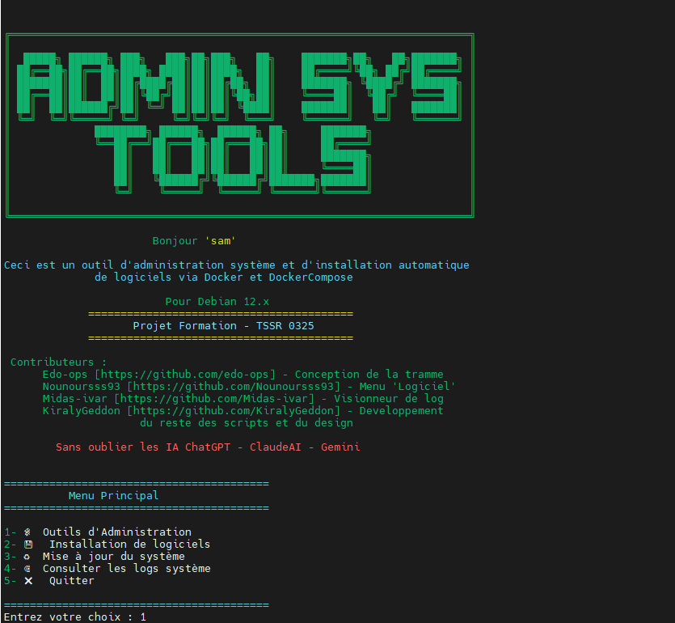

# Admin-Sys Tools



Boite d'outils pour un administrateur systeme. Peut etre encore amélioré.


## Pour commencer

Pour commencer, etre sur Linux, c'est une boite à outils pour une administration de système linux Debian 12. 
Prochainement nous ferons une version destinée à n'importe quelle distribution.

### Pré-requis

Ce qu'il est requis pour commencer avec votre projet...

- Soit etre connecté avec le compte root, soit etre avec un compte sudoer
- Sur Debian 12.x
- de l'indulgence, travail effectué en cours de formation TSSR

### Installation

```
sudo apt install -y git
git clone https://github.com/KiralyGeddon/AdminSysTools
cd AdminSysTools
sudo chmod +x *
```

Ensuite vous pouvez montrer ce que vous obtenez au final...

## Démarrage

Pour lancer le projet il suffit juste faire ``./main.sh`` pour lancer le script principal. 

Après, laissez vous guider!

## Fabriqué avec

_Logiciels :_
* [Visual Studio Code](http://https://code.visualstudio.com/) - Outil de developpement
* [VMware Workstation 17](https://www.vmware.com/products/desktop-hypervisor/workstation-and-fusion) - Hyperviseur type 2 avec VM linux Debian 12
* [Debian](https://www.debian.org/index.fr.html) - OS linux utilisé pour le developpement des scripts
* [MobaXterm](https://mobaxterm.mobatek.net/) - Connextion en SSH à la VM Linux + SFTP

_IA :_
* [ChatGPT](https://chatgpt.com/)
* [ClaudeAI](https://claude.ai)
* [Gemini](https://gemini.google.com/app?hl=fr)


## Auteurs

* **Kiraly Geddon** _alias_ [@KiralyGeddon](https://github.com/KiralyGeddon) pour le developpement, les test et améliorations.

* **Edouard Cot** _alias_ [@edo-obs](https://github.com/edo-obs) le squelette

* **Mehdi** _alias_ [@Midas-ivar](https://github.com/Midas-ivar) pour le visionneur de logs

* **Yann** _alias_ [@Nounoursss93](https://github.com/Nounoursss93) pour le menu d'installation de logiciels
